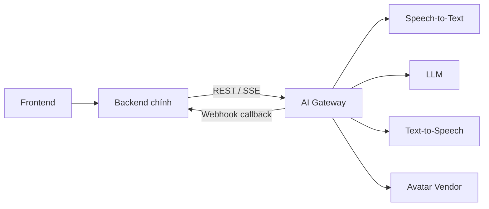
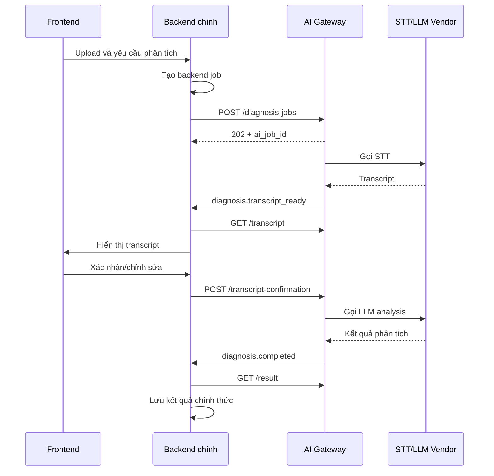

# AI Coach - Mô tả API AI Gateway

**Phiên bản:** 0.1.0  
**Tài liệu kỹ thuật đi kèm:** `AI_Gateway_API_Definition_v0.1.yaml`  
**Đối tượng đọc:** Nhóm Backend chính, nhóm AI Gateway và QA

## 1. Mục đích tài liệu

Tài liệu này giải thích bằng ngôn ngữ dễ đọc về API contract giữa **Backend chính** và **AI Gateway** của hệ thống AI Coach.

Luồng tổng quát:

```text
Frontend → Backend chính → AI Gateway → STT / LLM / TTS / Avatar Vendor
```

File YAML là nguồn định nghĩa chính xác để import vào Swagger/Postman. File Markdown này giúp các thành viên hiểu:

- trách nhiệm của Backend chính và AI Gateway;
- ý nghĩa của 16 API path;
- request/response của các luồng quan trọng;
- cách xử lý tác vụ bất đồng bộ, streaming và callback;
- những nội dung hai nhóm cần thống nhất trước khi triển khai.

## 2. Phạm vi và quyền sở hữu dữ liệu

### 2.1 Backend chính chịu trách nhiệm

- Xác thực người dùng và phân quyền.
- Quản lý Organization, Cohort, Learner và hồ sơ người dùng.
- Quản lý file upload và lưu trữ media chính thức.
- Quản lý job nghiệp vụ mà Frontend nhìn thấy.
- Quản lý credit/gói dịch vụ của người dùng.
- Lưu transcript, coaching report và debrief chính thức.
- Cung cấp API cho Frontend.
- Gọi AI Gateway bằng service credential.

### 2.2 AI Gateway chịu trách nhiệm

- Nhận yêu cầu xử lý AI từ Backend chính.
- Gọi và điều phối STT, LLM, TTS, Voice và Avatar vendor.
- Chuẩn hóa request/response của các vendor về contract chung.
- Quản lý tác vụ xử lý AI nội bộ, timeout, retry và lỗi vendor.
- Streaming phản hồi Text Roleplay.
- Cấp credential tạm thời cho Voice/Avatar.
- Gửi callback cho Backend khi tác vụ AI hoàn thành hoặc thất bại.
- Trả usage để Backend ghi nhận và kiểm soát chi phí.

### 2.3 Ý nghĩa của `job_id`

Backend chính vẫn là nơi quản lý **job nghiệp vụ**. `job_id` do AI Gateway trả về chỉ là **mã tác vụ xử lý AI nội bộ**, dùng để:

- liên kết job Backend với tác vụ AI;
- kiểm tra tiến trình xử lý;
- lấy transcript/kết quả;
- đối chiếu callback;
- phục vụ log và xử lý lỗi.

Ví dụ:

```text
Backend job ID: backend_analysis_001
AI Gateway job ID: aijob_01J...
```

Backend lưu quan hệ giữa hai ID. Trường `source_reference` chính là ID bên Backend, giúp AI Gateway trả đúng callback.

## 3. Kiến trúc giao tiếp



Backend chính không cần biết AI Gateway đang dùng OpenAI, Google, Azure hay nhà cung cấp nào khác. Nếu đổi vendor, contract giữa Backend và AI Gateway vẫn được giữ ổn định.

## 4. Quy ước chung

### 4.1 Base URL

Trong YAML hiện dùng URL minh họa:

```text
Staging:    https://ai-gateway.staging.example.com/v1
Production: https://ai-gateway.example.com/v1
```

Đây là placeholder. Khi deploy, nhóm AI Gateway phải cung cấp domain/IP thật cho Backend.

### 4.2 Xác thực service-to-service

Backend gửi service token:

```http
Authorization: Bearer <service-jwt>
```

AI Gateway không xác thực access token của người dùng cuối. Backend đã xác thực người dùng trước khi gọi AI Gateway.

### 4.3 Header chung

| Header | Bắt buộc | Ý nghĩa |
|---|---:|---|
| `Authorization` | Có | Service token giữa Backend và AI Gateway |
| `X-Request-Id` | Có | Theo dõi một request xuyên suốt hệ thống |
| `Idempotency-Key` | Với API tạo/thay đổi | Chống tạo trùng khi Backend retry |
| `Content-Type` | Có body JSON | `application/json` |

### 4.4 Response thành công

```json
{
  "data": {},
  "meta": {
    "request_id": "req_01J...",
    "processing_time_ms": 125
  }
}
```

### 4.5 Response lỗi

```json
{
  "error": {
    "code": "VENDOR_TIMEOUT",
    "message": "Speech-to-Text provider did not respond in time.",
    "retryable": true,
    "details": {}
  },
  "meta": {
    "request_id": "req_01J..."
  }
}
```

Backend nên dựa vào `error.code` và `retryable`, không phân tích nội dung `message` để quyết định logic.

## 5. Tổng quan 16 API path

### 5.1 Diagnosis

| Method | Path | Chức năng |
|---|---|---|
| `POST` | `/diagnosis-jobs` | Gửi media sang AI Gateway để bắt đầu chẩn đoán |
| `GET` | `/diagnosis-jobs/{jobId}` | Kiểm tra trạng thái tác vụ AI |
| `GET` | `/diagnosis-jobs/{jobId}/transcript` | Lấy transcript chuẩn hóa |
| `POST` | `/diagnosis-jobs/{jobId}/transcript-confirmation` | Gửi transcript đã sửa/xác nhận |
| `GET` | `/diagnosis-jobs/{jobId}/result` | Lấy kết quả phân tích và coaching report |

### 5.2 Recommendation

| Method | Path | Chức năng |
|---|---|---|
| `POST` | `/scenario-recommendations` | Gợi ý kịch bản luyện tập từ skill gap |

### 5.3 Persona

| Method | Path | Chức năng |
|---|---|---|
| `POST` | `/persona-interviews` | Bắt đầu phỏng vấn ngữ cảnh 3-4 câu |
| `POST` | `/persona-interviews/{interviewId}/messages` | Gửi câu trả lời và nhận câu hỏi tiếp theo |
| `POST` | `/persona-interviews/{interviewId}/generate` | Sinh custom persona từ kết quả phỏng vấn |

### 5.4 Roleplay

| Method | Path | Chức năng |
|---|---|---|
| `POST` | `/roleplay-sessions` | Tạo context AI cho phiên Roleplay |
| `GET` | `/roleplay-sessions/{sessionId}` | Kiểm tra trạng thái phiên AI |
| `POST` | `/roleplay-sessions/{sessionId}/messages` | Gửi một lượt Text Roleplay, hỗ trợ SSE |
| `POST` | `/roleplay-sessions/{sessionId}/realtime-credentials` | Cấp credential tạm cho Voice/Avatar |
| `POST` | `/roleplay-sessions/{sessionId}/end` | Kết thúc phiên và kích hoạt Debrief |
| `GET` | `/roleplay-sessions/{sessionId}/debrief` | Lấy kết quả đánh giá sau phiên |

### 5.5 Operations

| Method | Path | Chức năng |
|---|---|---|
| `GET` | `/health` | Kiểm tra AI Gateway còn hoạt động |

Ngoài 16 API path còn có một webhook `aiGatewayEvent`, dùng để AI Gateway chủ động thông báo kết quả về Backend chính.

## 6. Luồng Diagnosis chi tiết

### 6.1 Bước 1: Backend tạo job nghiệp vụ

Backend tạo một record trong database của mình, ví dụ:

```text
backend_analysis_001
```

### 6.2 Bước 2: Backend gọi AI Gateway

```http
POST /v1/diagnosis-jobs
Authorization: Bearer <service-jwt>
X-Request-Id: req_001
Idempotency-Key: diagnose_backend_analysis_001
Content-Type: application/json
```

Request mẫu:

```json
{
  "context": {
    "tenant_id": "org_001",
    "user_id": "usr_001",
    "source_reference": "backend_analysis_001",
    "locale": "vi-VN"
  },
  "media": {
    "url": "https://storage.example.com/signed/audio-object",
    "content_type": "audio/mp4",
    "duration_seconds": 780,
    "checksum_sha256": "0123456789abcdef0123456789abcdef0123456789abcdef0123456789abcdef",
    "url_expires_at": "2026-08-20T10:00:00Z"
  },
  "options": {
    "speaker_diarization": true,
    "require_transcript_confirmation": true,
    "analysis_modules": [
      "INTENT",
      "PERSONA_MAPPING",
      "BEHAVIORAL_GAPS",
      "COMPETENCY_SCORING",
      "COACHING_REPORT"
    ]
  },
  "callback": {
    "url": "https://backend.example.com/internal/webhooks/ai-gateway"
  }
}
```

Ý nghĩa các nhóm field:

| Nhóm | Ý nghĩa |
|---|---|
| `context` | Dữ liệu định danh/correlation do Backend cung cấp |
| `media` | URL tạm thời và metadata của file cần xử lý |
| `options` | Những bước phân tích AI cần chạy |
| `callback` | URL để AI Gateway báo kết quả về Backend |

### 6.3 Bước 3: AI Gateway nhận job

AI Gateway trả:

```http
202 Accepted
```

```json
{
  "data": {
    "job_id": "aijob_01J...",
    "source_reference": "backend_analysis_001",
    "status": "QUEUED",
    "current_step": "WAITING_FOR_WORKER",
    "progress_percent": 0,
    "attempt": 0,
    "result_available": false,
    "created_at": "2026-08-20T09:30:00Z",
    "updated_at": "2026-08-20T09:30:00Z"
  },
  "meta": {
    "request_id": "req_001"
  }
}
```

`202 Accepted` nghĩa là AI Gateway đã nhận tác vụ, chưa có nghĩa là phân tích đã hoàn thành.

### 6.4 Bước 4: AI Gateway xử lý STT

AI Gateway tải media từ signed URL rồi gọi STT vendor. Các trạng thái có thể gồm:

```text
QUEUED
→ TRANSCRIBING
→ AWAITING_TRANSCRIPT_CONFIRMATION
→ ANALYZING
→ COMPLETED
```

Trạng thái lỗi/kết thúc khác:

```text
FAILED / CANCELED / EXPIRED
```

### 6.5 Bước 5: Xác nhận transcript

Khi transcript sẵn sàng, AI Gateway callback về Backend. Backend lấy transcript:

```http
GET /v1/diagnosis-jobs/{jobId}/transcript
```

Frontend cho người dùng sửa text hoặc gán lại speaker. Backend gửi bản đã sửa:

```http
POST /v1/diagnosis-jobs/{jobId}/transcript-confirmation
```

```json
{
  "version": 1,
  "confirmed": true,
  "segments": [
    {
      "id": "seg_001",
      "start_ms": 1200,
      "end_ms": 4800,
      "speaker": "LEARNER",
      "text": "Em muốn trao đổi lại về thời hạn công việc."
    }
  ]
}
```

Trường `version` giúp ngăn việc ghi đè bằng một transcript cũ.

### 6.6 Bước 6: Lấy kết quả phân tích

Khi AI Gateway hoàn thành LLM analysis, Backend gọi:

```http
GET /v1/diagnosis-jobs/{jobId}/result
```

Kết quả gồm:

- summary;
- intent;
- competency score;
- behavioral gap;
- evidence từ transcript;
- recommendation;
- contract, prompt và model version.

Backend lưu kết quả này vào database chính và trả dữ liệu cần thiết cho Frontend.

### 6.7 Sequence Diagram



## 7. Scenario Recommendation

Endpoint:

```http
POST /v1/scenario-recommendations
```

Backend gửi:

- competency scores;
- behavioral gaps;
- danh sách scenario hiện có do Backend quản lý;
- số lượng gợi ý tối đa.

AI Gateway chỉ chọn và xếp hạng scenario. AI Gateway không nhất thiết sở hữu thư viện scenario.

Response gồm:

- `scenario_id`;
- `priority`;
- `recommended_difficulty`;
- lý do lựa chọn;
- năng lực mục tiêu.

## 8. Custom Persona

### 8.1 Bắt đầu interview

```http
POST /v1/persona-interviews
```

AI Gateway tạo cuộc phỏng vấn ngắn 3-4 câu nhằm thu thập:

- mối quan hệ với đối phương;
- phong cách giao tiếp;
- mục tiêu;
- hành vi/câu nói gây áp lực;
- mức độ chống đối.

### 8.2 Trả lời từng câu

```http
POST /v1/persona-interviews/{interviewId}/messages
```

Backend gửi một `answer`; AI Gateway trả `next_question` hoặc trạng thái `READY_TO_GENERATE`.

### 8.3 Sinh persona

```http
POST /v1/persona-interviews/{interviewId}/generate
```

Persona chuẩn hóa gồm:

- `display_name`;
- `relationship_group`;
- `communication_style`;
- `triggers`;
- `goals`;
- `resistance_level`;
- `avatar_hint` nếu có.

## 9. Text Roleplay

### 9.1 Tạo phiên AI

```http
POST /v1/roleplay-sessions
```

Backend gửi:

- `source_reference` của session bên Backend;
- mode: `TEXT`, `VOICE` hoặc `AVATAR`;
- persona;
- scenario;
- giới hạn thời lượng và số turn;
- kết quả diagnosis liên quan nếu có.

Backend quản lý phiên người dùng chính thức. `session_id` của AI Gateway là mã context AI/provider để hai bên đối chiếu.

### 9.2 Gửi tin nhắn

```http
POST /v1/roleplay-sessions/{sessionId}/messages
```

Request:

```json
{
  "client_message_id": "msg_001",
  "text": "Em muốn làm rõ các ưu tiên trước khi cam kết deadline."
}
```

Backend có thể nhận response hoàn chỉnh bằng JSON hoặc stream bằng SSE.

Các event SSE chuẩn:

```text
turn.started
turn.delta
state.changed
turn.completed
```

Ví dụ:

```text
event: turn.delta
data: {"text":"Tôi cần bạn cam kết..."}

event: state.changed
data: {"emotion_state":"DEFENSIVE","escalation_level":2}
```

Backend có thể proxy SSE này xuống Frontend.

## 10. Voice và Avatar

Endpoint:

```http
POST /v1/roleplay-sessions/{sessionId}/realtime-credentials
```

AI Gateway gọi vendor để tạo credential tạm thời. Response có thể gồm:

- token tạm thời;
- thời gian hết hạn;
- WebRTC/WebSocket endpoint;
- ICE servers;
- cấu hình audio-only fallback.

Permanent API key của vendor không được trả về Backend hoặc Frontend.

Luồng đề xuất:

```text
Backend → AI Gateway: xin credential
AI Gateway → Vendor: tạo realtime session
AI Gateway → Backend: credential tạm thời
Backend → Frontend: credential tạm thời
Frontend → Vendor: kết nối WebRTC
Vendor/AI Gateway → Backend: usage và trạng thái kết thúc
```

Thiết kế này cần được chốt lại sau POC vì phụ thuộc SDK và cơ chế của vendor được chọn.

## 11. Kết thúc Roleplay và Debrief

Backend kết thúc phiên:

```http
POST /v1/roleplay-sessions/{sessionId}/end
```

AI Gateway đóng kết nối vendor và bắt đầu tạo debrief. API trả `202 Accepted` nếu debrief chạy bất đồng bộ.

Khi hoàn thành, AI Gateway gửi event:

```text
roleplay.debrief_completed
```

Backend lấy kết quả:

```http
GET /v1/roleplay-sessions/{sessionId}/debrief
```

Debrief gồm:

- outcome;
- summary;
- competency scores;
- emotion/escalation timeline;
- critical moments;
- alternative recommendations;
- model/prompt/contract version;
- usage.

## 12. Webhook AI Gateway → Backend

Webhook trong OpenAPI có tên:

```text
aiGatewayEvent
```

Các event hiện được định nghĩa:

| Event | Ý nghĩa |
|---|---|
| `diagnosis.transcript_ready` | Transcript đã sẵn sàng |
| `diagnosis.completed` | Phân tích hoàn thành |
| `diagnosis.failed` | Tác vụ chẩn đoán thất bại |
| `roleplay.debrief_completed` | Debrief hoàn thành |
| `roleplay.failed` | Phiên AI thất bại |
| `usage.recorded` | Có usage mới cần ghi nhận |

AI Gateway gửi các header:

```http
X-AI-Gateway-Event-Id: evt_01J...
X-AI-Gateway-Timestamp: 2026-08-20T09:42:00Z
X-AI-Gateway-Signature: <hmac-signature>
```

Backend cần:

1. Xác minh timestamp và HMAC signature trên raw body.
2. Chống xử lý trùng bằng `event_id`.
3. Lưu event hoặc đưa vào queue.
4. Chỉ sau đó mới trả `200 OK`.

Callback URL trong request chỉ được phép thuộc allowlist cấu hình trước, tránh AI Gateway gửi request đến địa chỉ tùy ý.

## 13. HTTP status chính

| Status | Ý nghĩa |
|---|---|
| `200 OK` | Thao tác đồng bộ thành công |
| `201 Created` | Tạo resource/context AI thành công |
| `202 Accepted` | Đã nhận tác vụ bất đồng bộ nhưng chưa hoàn tất |
| `400 Bad Request` | Request sai cú pháp/thiếu field |
| `401 Unauthorized` | Service credential không hợp lệ |
| `404 Not Found` | Không tìm thấy AI job/session |
| `409 Conflict` | Sai trạng thái, version hoặc idempotency |
| `422 Unprocessable Entity` | Dữ liệu đúng JSON nhưng sai nghiệp vụ |
| `429 Too Many Requests` | Vượt rate limit/concurrency |
| `503 Service Unavailable` | Vendor bắt buộc tạm thời không hoạt động |

## 14. Cách hai nhóm sử dụng contract

### 14.1 Nhóm Backend chính

- Import YAML vào Swagger/Postman.
- Review endpoint và JSON field.
- Tạo DTO/request/response model theo schema.
- Xây client gọi AI Gateway.
- Xây webhook endpoint nhận callback.
- Lưu mapping giữa Backend ID và AI Gateway ID.
- Có thể dùng mock response trước khi AI Gateway chạy thật.

### 14.2 Nhóm AI Gateway

- Xây API đúng path, method và schema đã chốt.
- Trả đúng HTTP status và error format.
- Tạo adapter cho từng STT/LLM/TTS/Avatar vendor.
- Chuẩn hóa output vendor về schema trong contract.
- Xử lý retry, timeout, idempotency và callback.
- Tạo mock implementation trước, sau đó thay bằng vendor thật.

### 14.3 Nhóm QA

- Dùng OpenAPI sinh test case.
- Kiểm tra happy path và error path.
- Kiểm tra duplicate request/callback.
- Kiểm tra transcript version conflict.
- Kiểm tra vendor timeout và retryable error.
- Kiểm tra SSE event order.
- Kiểm tra Voice/Avatar token hết hạn.

## 15. Những điểm cần chốt trước khi freeze v0.1

1. Backend truyền signed media URL hay upload file trực tiếp sang AI Gateway?
2. Backend theo dõi tiến trình bằng polling, webhook hay cả hai?
3. `job_id` của AI Gateway có cần giữ lâu hay chỉ trong thời gian xử lý?
4. Mọi transcript đều cần người dùng xác nhận hay chỉ transcript confidence thấp?
5. Backend hay AI Gateway lưu trạng thái Persona Interview?
6. Scenario catalogue do Backend quản lý, đúng không?
7. Service authentication dùng JWT, API key nội bộ hay mTLS?
8. Callback URL cố định theo môi trường hay truyền trong từng request?
9. Giới hạn file: MIME type, dung lượng, thời lượng và thời gian signed URL.
10. Error code và retry policy nào Backend sẽ tự động retry?

## 16. Phạm vi MVP khuyến nghị

Không nhất thiết triển khai đồng thời toàn bộ 16 path. Có thể ưu tiên:

### P0 - Diagnose

- `POST /diagnosis-jobs`
- `GET /diagnosis-jobs/{jobId}`
- `GET /diagnosis-jobs/{jobId}/transcript`
- `POST /diagnosis-jobs/{jobId}/transcript-confirmation`
- `GET /diagnosis-jobs/{jobId}/result`
- webhook Diagnosis

### P0 - Text Roleplay

- `POST /roleplay-sessions`
- `POST /roleplay-sessions/{sessionId}/messages`
- `POST /roleplay-sessions/{sessionId}/end`
- `GET /roleplay-sessions/{sessionId}/debrief`

### P1

- Scenario Recommendation
- Custom Persona Interview
- Voice realtime
- Avatar realtime